# Morndas

This is a very, very small scale Lab aimed at recreating an enterprise network that
can then be emulated by the average Steam User; sadly, not immediately grandmother-compatible.

# Necessities~ 
- VirtualBox *(VMWare packages were out of date at the time)*
- A Windows Desktop ISO, 10; found [here](https://www.microsoft.com/en-us/software-download/windows10ISO)
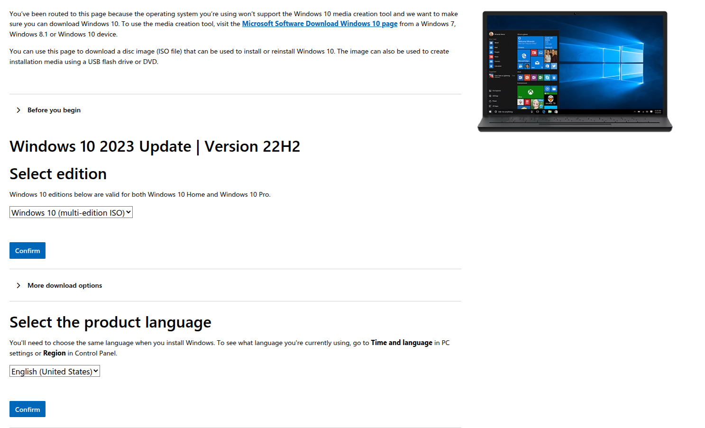
- A Windows Server 2016 & up; found [here](https://www.microsoft.com/en-us/evalcenter/download-windows-server-2016)
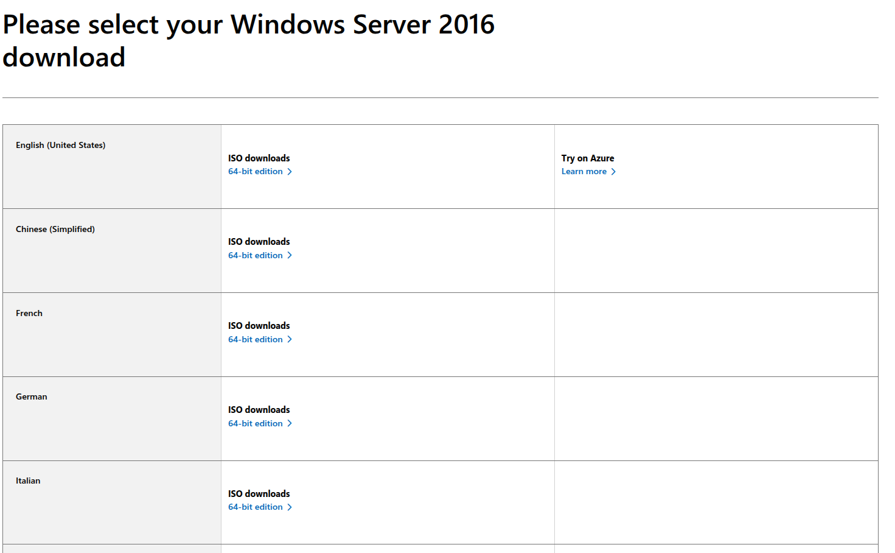
- Google; found [HERE](https://www.google.com)


## Installing VirtualBox

For Arch, follow the [ArchWiki](https://wiki.archlinux.org/title/VirtualBox).
For Debian, follow the [Debian Wiki](https://wiki.debian.org/VirtualBox).
Alternatively, don't listen to me and go straight to the [source](https://www.virtualbox.org/manual/ch02.html).

For *me*, on **6.14.2-arch1-1**:
```bash
# Firstly, check for updates
pacman -Syyu
# Then, once finished, if updates were installed, reboot.
reboot
# Lastly, installing
pacman -Syy virtualbox virtualbox-host-modules-arch
```


## Creating the Virtual Machines (VM)

This should be a *relatively* equivalent process; unless you want to be fancy.


### **Intro: Scary Buttons**

Don't panic!!!! Just click the button that looks like a **BLUE ASTERISK**, kind of; it says **'New'** under it. For now, only worry about that button, as the other buttons aren't relevant yet.
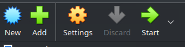


### **Name and Operating System**
1. **Name** both of the VMs after your favorite snack
2. **Folder** can remain as is, unless you want it somewhere else of course.
3. **ISO Image** is the '/path/to/your/iso'; Likely in your Downloads folder; should also fill in settings below, meaning Edition is the *big* one to worry about.
4. **Edition** *really* only matters for the Windows Server (sort of), making you decide, at least for 2016, two things: Whether you want a purely command-line
server or Desktop 'Experience'; and whether you want a *Standard* Edition or *Datacenter* Edition of the server. The differences between the two is 'minimal',
**this small lab takes place on Datacenter Edition (Desktop Experience)**. Differences between *Standard*, *Datacenter*, and *Datacenter: Azure Edition* can be found [HERE](https://learn.microsoft.com/en-us/windows-server/get-started/editions-comparison?pivots=windows-server-2025).
As for the *sort of* from the beginning of this part (4), the Windows 10 Edition that **SHOULD** be chosen is either **Pro** or **Enterprise**; as these are the editions that allow joining of Domains, among other things. More information on this can be found [HERE](https://answers.microsoft.com/en-us/insider/forum/all/what-are-the-editions-of-windows-10-available/195a4038-c061-4902-bc2b-35922c9d41bc).
5. **Subtype** is the *flavour* of the primary operating system, so to speak; not relevant here.
6. **Version** SHOULD have auto-filled to the corresponding OS, if not, match it to the Windows 10 or Windows Server (year) 64-bit.
7. **Skip unattended install**, *shouldn't* hurt much in this process.
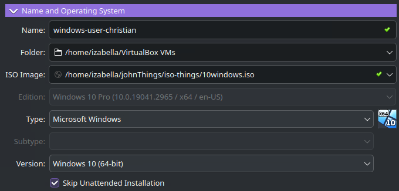


### **Unattended Install**
1. **Credentials** (user/pswd) can be whatever you want.
2. **Product Keys** can be ignored, as always.
3. **Host Names** aren't something I worried about during this, you may; or not.
4. **Domain Names**, aren't something I worried about during this, you may; or not.
5. **Install in Background** will just install this in a headless form, no GUI/screen to see;
6. **Guest Additions** can be checked if you have a file for it on hand, else I just installed it later in the VM.
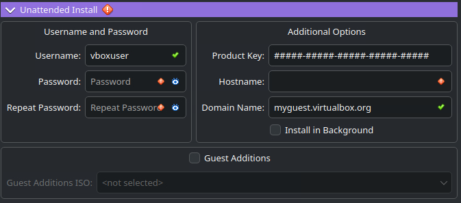


### Hardware
1. **Base Memory** was set to 4096 MB for *both* machines; but it *can* be more or less as wanted or required.
2. **Processors** was set to 2 for *both* machines but it can be more or less as wanted or required. 
3. **Enable EFI** is irrelevant here, as this isn't an Apple Mac; aside from being just unnecessary here. 
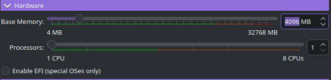


### Hard Disk
1. **Create a Virtual Hard Disk Now** was used as opposed to the other 2 options, as having storage is nice. Didn't need to do anything fancy here.
2. **Default** path used: $HOME/USER/VirtualBox VMs/
3. **50.00 GB** of storage,
3. **VDI (VirtualBox Disk Image)** format used,
4. **NOT pre-allocated**, *nor* split into 2GB parts.
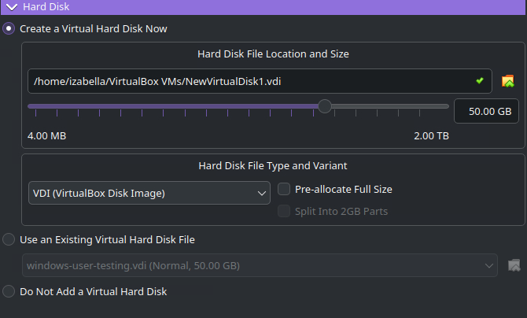


## Windows 10 Installation
Assuming all went well, the Virtual Machine (VM) should open up to a navy blue screen with a few immediate options; don't overthink it. You're likely even keep a chunk of them as their defaults; other editions, if chosen at the beginning, may have differences in choices, **I** wouldn't know right now.

### Stage 1
1. **Languages to install**: Pre-defined by whichever language you chose when installing the ISO; other editions may come with choices; I've no idea.
2. **Time and currency format:** Should choose the same as your chosen language, unless you want or need otherwise.
3. **Keyboard and input method:** Should choose the same as your chosen language, unless you want or need otherwise.

When all is said and done, click '**Next**'!!
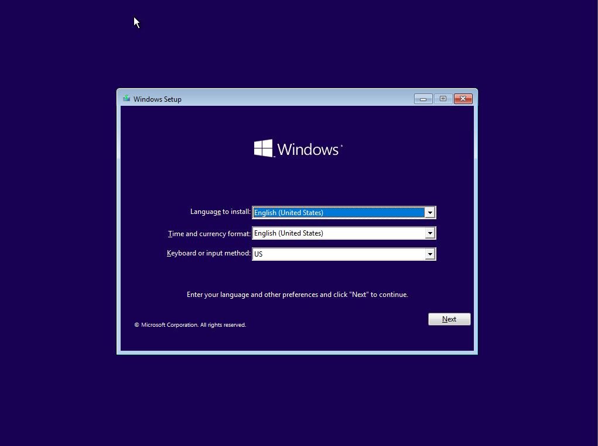

### Stage 2
1. **Click** the single button in the center, "**Install now**", don't worry about the other buttons.
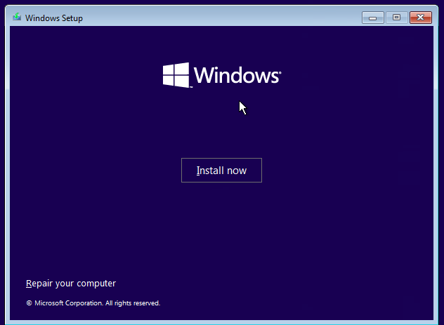


### Stage 3
1. Wait.
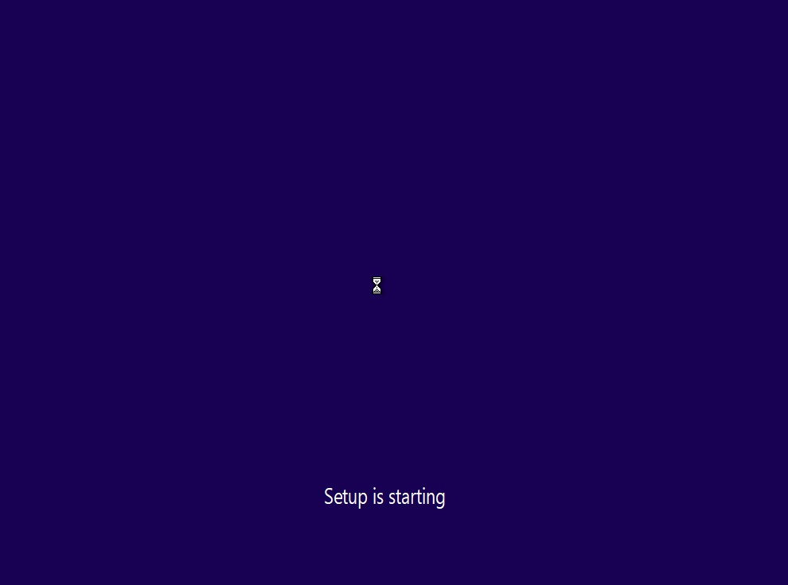

### Stage 4
You'll now see a bit of text:   
1. Ignore all of text, reading is scary.
2. Click the blue '**I don't have a product key**' button at the bottom of that same white box; sitting next to the '*Next*' button.

No use trying to find a Windows key, not in the bright year of 2025.
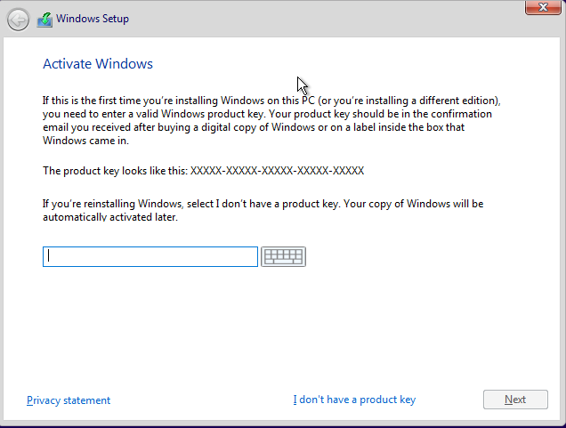


